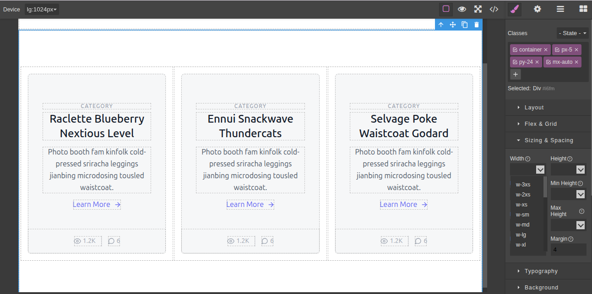

# GrapesJS Tailwind StyleManager


A prototype plugin for the [GrapesJS](https://grapesjs.com/) editor ( [Documentation link](https://grapesjs.com/docs/)) that provides a comprehensive style manager for [Tailwind CSS](https://tailwindcss.com/). This plugin aims to bring the full power of Tailwind's utility-first workflow directly into the GrapesJS Style Manager UI.

All CSS properties are meticulously organized and grouped according to the official Tailwind CSS documentation, making it intuitive for developers familiar with the framework.

**Disclaimer:** Please note that this plugin is currently a **prototype** of an idea. It is not yet stable or optimized for production environments.

---

## ✨ Key Features

* **Complete Tailwind Property Inputs:** Provides UI controls for every CSS property available in Tailwind CSS.
* **Logical Grouping:** Properties are structured to mirror the [Tailwind CSS documentation](https://tailwindcss.com/docs/utility-first), enhancing usability and learning.
* **Direct Documentation Links:** Each property includes a convenient link that takes you directly to its corresponding page on the Tailwind CSS docs, making it easy to look up details.
* **Intelligent Input Fields:** The inputs are designed to streamline the process of adding Tailwind classes with support for both predefined and arbitrary values.

## 🚀 Getting Started

This project is built using [Vite](https://vitejs.dev/). To get it running on your local machine, follow these steps.

### Prerequisites

* [Node.js](https://nodejs.org/) (v18 or later recommended)
* [npm](https://www.npmjs.com/get-npm) or another package manager like [yarn](https://yarnpkg.com/) or [pnpm](https://pnpm.io/)

### Installation and Setup

1.  **Clone the repository:**
    ```bash
    git clone [https://github.com/developerpaddy/grapesjs-tailwind-stylemanager.git](https://github.com/developerpaddy/grapesjs-tailwind-stylemanager.git)
    ```

2.  **Navigate to the project directory:**
    ```bash
    cd your-repo-name
    ```

3.  **Install the dependencies:**
    ```bash
    npm install
    ```

4.  **Run the development server:**
    ```bash
    npm run dev
    ```
    This will start the Vite development server. You can view the project by navigating to the local URL provided in your terminal (usually `http://localhost:5173`).

### Available Scripts

* `npm run dev`: Starts the development server with Hot Module Replacement (HMR).
* `npm run build`: Compiles and bundles the project for production.
* `npm run preview`: Serves the production build locally to preview it.

## 🚀 How to Use the Input Fields

The input fields have special logic to help you generate Tailwind classes efficiently.

### 1. Predefined Values

When a Tailwind property has a predefined set of values (e.g., `margin`, `display`), an arrow button will appear next to the input field. Clicking this button will reveal a dropdown list of all the available class values for that property.

### 2. Arbitrary Values

For properties that support arbitrary values, the input field will help you generate the correct class syntax. You must start your input with the appropriate characters (like `[` or `(`) and then select the generated class from the dropdown list.

> **Important:** The class is applied only when you **select an option from the dropdown list**. Simply hitting the "Enter" key after typing will not apply the style.

Here are the main types of arbitrary values supported:

| Type       | User Input Example | Generated Class Example | Description                                                                                             |
| :--------- | :----------------- | :---------------------- | :------------------------------------------------------------------------------------------------------ |
| **Value** | `[10px]`           | `m-[10px]`              | For specific length, color, or other values. Must be enclosed in square brackets `[]`.                   |
| **Number** | `24`               | `m-24`                  | For raw number values that correspond to Tailwind's spacing scale or other numeric scales.              |
| **Fraction**| `1/2`              | `w-1/2`                 | For fractional values, commonly used for `width` and `height`.                                          |
| **Custom** | `(--my-margin)`    | `m-(--my-margin)`       | For using CSS Custom Properties (variables). Must be enclosed in parentheses `()`.                      |

If you are ever unsure about which values a property supports, please refer to the official [Tailwind CSS documentation](https://tailwindcss.com/docs/utility-first).

## Fair Use Policy

This project is distributed with the following fair use policy:

* **Permitted Use:** You are free to use this plugin for non-commercial purposes, including:
    * Educational use (learning, teaching, school projects).
    * College and university projects.
    * Inclusion in other open-source projects.
* **Commercial Use:** For any commercial use, you **must obtain prior written permission** from the author. Please open an issue on this repository to request permission.

## ❤️ Support

If you find this plugin useful or like the idea, your support would be greatly appreciated! You can support the project by:

* Giving it a ⭐ on GitHub.
* Reporting bugs or suggesting features by creating an issue.
* Contributing to the code.

## 📦 Included Plugins in this Repository

To provide a functional starting point, this repository has been initialized with a few other excellent GrapesJS plugins:

* **Grapesjs-Tailwind**: Provides a set of basic Tailwind blocks for GrapesJS.
    * Author: [Ju99ernaut](https://github.com/Ju99ernaut)
    * Repository: <https://github.com/Ju99ernaut/grapesjs-tailwind>
* **Grapesjs-tailwindcss-plugin**: Integrates Tailwind CSS with GrapesJS, enabling the use of Tailwind classes on components.
    * Author: [fasenderos](https://github.com/fasenderos)
    * Repository: <https://github.com/fasenderos/grapesjs-tailwindcss-plugin>
* **grapesjs-blocks-basic**: The official basic blocks plugin from the GrapesJS team.

A huge thank you to the authors of these plugins for their valuable contributions to the GrapesJS ecosystem.
